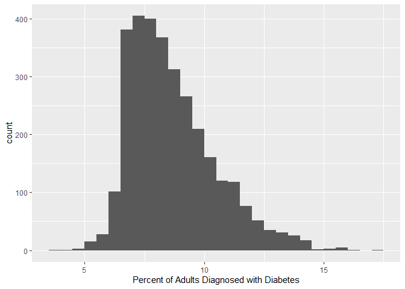
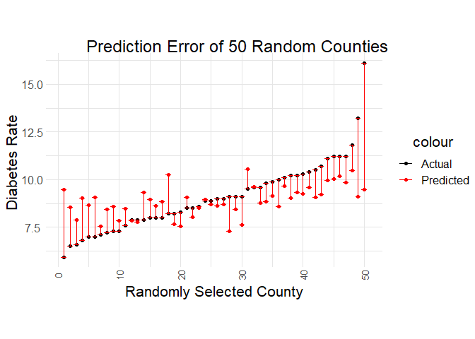
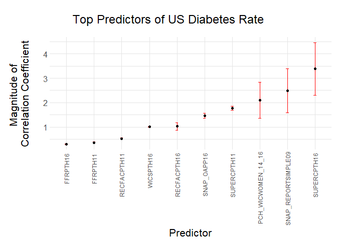

Food Environmental Predictors of County Level Diabetes Rates
================
Jonas Kazlauskas and Shawn Albertson
12/15/2020

  - [Introduction](#introduction)
  - [Our question](#our-question)
  - [Initial EDA](#initial-eda)
  - [Methodology](#methodology)
  - [Results](#results)
  - [Evaluating Model Effectiveness](#evaluating-model-effectiveness)
  - [Quantifying Uncertainty](#quantifying-uncertainty)
      - [Other Sources of Uncertainty](#other-sources-of-uncertainty)
  - [Conclusion](#conclusion)
  - [Sources](#sources)

## Introduction

The first dataset we used for our analysis is the Food Environment
Atlas, taken from the USDA Economic Research Service. This datatset
contains information on a number of food related environmental factors
such as proximity to stores, food prices, food assistance programs,
local food availability. It also includes data on factors that may be
related to these such as obesity rate, diabetes rate, and physical
activity. This data is provided on the country level across the United
States. The purpose of the food environment atlas is to foster research
in these areas, and give an overview of food access and health.The data
for the Food Environment Atlas is largely taken from CDC estimates. The
CDC uses data from the Behavioral Risk Factor Surveillance System which
is under the US Census Bureau to make estimates.

We combined this dataset with 2018 county level diabetes data taken from
the CDC. We chose to use this data as it was more recent than what was
included in the Environmental Atlas, but ultimately came from the same
source. This data is from a reputable government source, and we expect
it to display accurate data.

Diabetes rate in this dataset is defined as the rate (percent) of
persons over 18 years old with a BMI over 30 within each county. We
compared this rate at the county level between other factors in this
dataset such as proximity to grocery stores, food insecurity,
socioeconomic factors and more to determine the best predictors.

## Our question

We set out to answer the question: What are the best predictors of adult
diabetes rate in the US?

## Initial EDA

``` r
path <- "data/FoodEnvironmentAtlas.xls"
# Create a list of dataframes from every sheet in the Food Environment Atlas
full_list <- path %>%
  excel_sheets() %>%
  set_names() %>%
  map(read_excel, path = path)

# Get updated county level diabetes rates for 2018
diabetes_path <- "data/diabetes2018.csv"
df_diabetes18 <- 
  read_csv(
    diabetes_path,
    skip = 2
  ) %>% 
  rename(
    "FIPS" = County_FIPS, 
    "diabetes18" = "Diagnosed Diabetes Percentage"
    ) %>% 
  select(c(FIPS, diabetes18)) %>% 
  mutate(FIPS = ifelse(nchar(FIPS) == 4, paste("0", FIPS, sep = ""), FIPS))
```

    ## Parsed with column specification:
    ## cols(
    ##   Year = col_double(),
    ##   County_FIPS = col_double(),
    ##   County = col_character(),
    ##   State = col_character(),
    ##   `Diagnosed Diabetes Percentage` = col_double(),
    ##   `Overall SVI` = col_double()
    ## )

    ## Warning: 1 parsing failure.
    ##  row  col expected                                                                                                                                     actual                    file
    ## 3142 Year a double US Diabetes Surveillance System; www.cdc.gov/diabetes/data; Division of Diabetes Translation - Centers for Disease Control and Prevention. 'data/diabetes2018.csv'

``` r
# Add new diabetes data to list of data frames
full_list[[length(full_list)]] <- df_diabetes18

# Create a modified list of the dataframes to only include ones with `FIPS` columns
fips_list <- full_list[c(3, 5:10, 12:length(full_list))]

# Create a single dataframe with all parameters for all counties
df_full_fips <- 
  fips_list %>% 
  reduce(inner_join, by = c("FIPS"))

# Remove columns from dataframe that are not valid predictors. In our case, we remove columns that are geographic in nature or contain data also describing diabetes.
df_full <- 
  df_full_fips %>% 
  select(-c("FIPS", matches("State"), matches("County"), "PCT_DIABETES_ADULTS08", "PCT_DIABETES_ADULTS13"))
```

The most obvious thing to notice from is the fact that this dataset
includes a lot of different statistics. Specifically, there are 177
statistics reported for 3139 FIPS codes. We also looked at some summary
statistics for `diabetes18` which contains the percentage rates of
diabetes diagnosed in adults in each county in 2018. We can see that the
mean diabetes rate is about 8.72%, which is slightly higher than the
CDC’s 2020 estimate of national diabetes rate at 10.2% \[6\]. A
histogram allows us to visualize the distribution that diabetes rate
takes across all counties. The distribution looks roughly lognormal,
with the peak shifted below the mean. When we isolate the counties with
the ten highest diabetes rates, we find a range of states, but three out
of the ten listed are actually in South Dakota.

``` r
df_full %>% 
  dim()
```

    ## [1] 3139  177

``` r
df_full_fips %>%
  select(diabetes18) %>% 
  summary()
```

    ##    diabetes18    
    ##  Min.   : 3.800  
    ##  1st Qu.: 7.350  
    ##  Median : 8.400  
    ##  Mean   : 8.722  
    ##  3rd Qu.: 9.700  
    ##  Max.   :17.200

``` r
df_full_fips %>% 
  select(c("County.x", "State.x", "diabetes18")) %>% 
  arrange(desc(diabetes18)) %>% 
  head(10)
```

    ## # A tibble: 10 x 3
    ##    County.x            State.x        diabetes18
    ##    <chr>               <chr>               <dbl>
    ##  1 Williamsburg County South Carolina       17.2
    ##  2 Gadsden County      Florida              16.1
    ##  3 McKinley County     New Mexico           15.9
    ##  4 Todd County         South Dakota         15.9
    ##  5 Ziebach County      South Dakota         15.9
    ##  6 Sunflower County    Mississippi          15.7
    ##  7 Boone County        West Virginia        15.7
    ##  8 Letcher County      Kentucky             15.4
    ##  9 Dewey County        South Dakota         15.3
    ## 10 Washington Parish   Louisiana            15.1

``` r
df_full_fips %>%
  select(diabetes18) %>% 
  ggplot() +
  geom_histogram(aes(x = diabetes18), binwidth = .5, boundary = 10) +
  xlab("Percent of Adults Diagnosed with Diabetes")
```

<!-- -->

## Methodology

In order to isolate the most important factors in a model to predict
diabetes, we used a technique called lasso regression. Lasso regression
is a form of **regularization**, which describes a family of techniques
that help your model effectively balance **bias** and **variance**. In
other words, a model should be optimized such that it is neither
**underfit** (high bias) nor **overfit** (high variance). One way to
overfit a model is to make coefficients which are too high, leading to a
model which works very well for a training data but not as well on yet
unseen data. On the other hand, eliminating too many features of a model
may be oversimplified and have high bias.

We used the `glmnet` package in R to do lasso regression. This package
depends on us creating a **design matrix** rather than inputting a
dataframe directly. We use the function `model.matrix` to compute the
design matrix for the linear model predicting `diabetes18` using every
other column and every observed county. This function removes rows with
`NA` values from the dataframe, so the result is somewhat shorter than
the input. The use of `glmnet` also depends on creating a list of the
values we want to predict.

``` r
# Create a matrix of all the predictors in df_full
# This also makes everything numeric and turns qualitative data into dummy vars.
x_vars <- model.matrix(diabetes18~. , df_full)

# Pull diabetes rates into a list
y_var <- df_full$diabetes18
```

Key to using lasso regression is splitting data into a training set and
a testing set. The training set is used to inform the coefficients of a
linear model, while the testing set is used to evaluate how well those
coefficients work on data which is not used to develop the model itself.

``` r
# Set sampling random seed
set.seed(4)

# Train is a list of indexes from where training data is taken
train = sample(1:nrow(x_vars), nrow(x_vars)/2)

training_data_x <- x_vars[train,]
training_data_y <- y_var[train]

# x_test is indexes where training data is NOT taken
x_test = (-train)

# y_test is values at testing indexes
y_test = y_var[x_test]
```

Lasso regression introduces a parameter `lambda` which penalizes high
correlation coefficients. A higher lambda value penalizes high
regression coefficients more, resulting in a model with lower overall
regression coefficients and high bias. Increasingly higher lambda values
reduces the weakest correlation coefficients to zero, and in theory an
infinitely high lambda value should *reduce all regression coefficients
to zero*.

A lower lambda value penalizes high regression coefficients less,
resulting in higher overall coefficients and high variance. The
following image shows a representation of what this might look like for
a single variable, and a similar thing happens in higher dimensions. In
lasso regression, a range of lambda values are tested in order to find
the ideal tradeoff between bias and variance.


``` r
# setup a sequence of lambda values to go through.
lambda_seq <- 10^seq(2, -2, by = -.1)

# Call glmnet function
cv_output = cv.glmnet(training_data_x,
                   training_data_y,
                   alpha = 1,
                   lambda = lambda_seq) # Fit lasso model on training data
plot(cv_output) # Draw plot of training MSE as a function of lambda
```

<!-- -->

``` r
cv_output
```

    ## 
    ## Call:  cv.glmnet(x = training_data_x, y = training_data_y, lambda = lambda_seq,      alpha = 1) 
    ## 
    ## Measure: Mean-Squared Error 
    ## 
    ##      Lambda Measure     SE Nonzero
    ## min 0.03981   2.679 0.2099      45
    ## 1se 0.07943   2.816 0.2497      29

The plot above shows the MSE of the model outcome for different `lambda`
values. The top of the graph lists the number of predictors left for
every value of `lambda`. At the lowest values of `lambda`, the greatest
number of predictors is used, but this leads to an overfit model.
Eventually, all predictors are dropped to zero and the model is
ineffective. An ideal model uses a `lambda` which minimizes the MSE.

``` r
# Create model with minimum lambda value
lambda_min <- cv_output$lambda.min
lasso_min <- glmnet(x_vars[train,], y_var[train], alpha = 1, lambda = lambda_min)
pred_min <- predict(lasso_min, s = lambda_min,  newx = x_vars[x_test,])

lasso_min %>% 
  tidy() %>%
  mutate(est_ab = abs(estimate)) %>%
  arrange(desc(est_ab))
```

    ## # A tibble: 47 x 6
    ##    term                 step estimate lambda dev.ratio est_ab
    ##    <chr>               <dbl>    <dbl>  <dbl>     <dbl>  <dbl>
    ##  1 (Intercept)             1   16.6   0.0398     0.316 16.6  
    ##  2 SUPERCPTH16             1    3.38  0.0398     0.316  3.38 
    ##  3 SNAP_REPORTSIMPLE09     1   -2.48  0.0398     0.316  2.48 
    ##  4 PCH_WICWOMEN_14_16      1    2.09  0.0398     0.316  2.09 
    ##  5 SUPERCPTH11             1    1.77  0.0398     0.316  1.77 
    ##  6 SNAP_OAPP16             1   -1.47  0.0398     0.316  1.47 
    ##  7 RECFACPTH16             1   -1.03  0.0398     0.316  1.03 
    ##  8 WICSPTH16               1   -1.00  0.0398     0.316  1.00 
    ##  9 RECFACPTH11             1   -0.527 0.0398     0.316  0.527
    ## 10 FFRPTH11                1   -0.362 0.0398     0.316  0.362
    ## # ... with 37 more rows

## Results

After fitting the model, we found that these predictors had the
strongest correlation coefficients.

| Variables            | Meaning                                            | Estimate |
| -------------------- | -------------------------------------------------- | -------- |
| SUPERCPTH16          | Supercenters & club stores, 2016                   | 3.382    |
| SNAP\_REPORTSIMPLE09 | SNAP simplified reporting, 2009\*                  | \-2.482  |
| PCHWICWOMEN\_14\_16  | WIC women participants (change % women), 2014-16\* | 2.093    |
| SUPERCPTH11          | Supercenters & club stores, 2011                   | 1.771    |
| SNAP\_OAPP16         | SNAP online application, 2016\*                    | \-1.465  |
| RECFACPTH16          | Recreation & fitness facilities/1,000 pop, 2016    | \-1.0271 |
| WICSPTH16            | WIC-authorized stores/1,000 pop, 2016              | \-1.004  |
| RECFAPTH11           | Recreation & fitness facilities/1,000 pop, 2011    | \-0.526  |
| FFRPTH11             | Full-service restaurants/1,000 pop, 2011           | \-0.361  |
| FFRPTH16             | Fast-food restaurants/1,000 pop, 2016              | \-0.297  |
| CHIPSTAX\_VENDM14    | Chip & pretzel sales tax, vending, 2014\*          | \-0.147  |

## Evaluating Model Effectiveness

To evaluate our model, we found the mean squared error between our
predicted values and actual values.

    ## Warning: `as.tibble()` is deprecated as of tibble 2.0.0.
    ## Please use `as_tibble()` instead.
    ## The signature and semantics have changed, see `?as_tibble`.
    ## This warning is displayed once every 8 hours.
    ## Call `lifecycle::last_warnings()` to see where this warning was generated.

    ## Warning in cbind(y_var[x_test], pred_min): number of rows of result is not a
    ## multiple of vector length (arg 1)

    ## Warning: The `x` argument of `as_tibble.matrix()` must have unique column names if `.name_repair` is omitted as of tibble 2.0.0.
    ## Using compatibility `.name_repair`.
    ## This warning is displayed once every 8 hours.
    ## Call `lifecycle::last_warnings()` to see where this warning was generated.

``` r
mse <- mean((final$Predicted - final$Actual)^2)
mse
```

    ## [1] 2.713412

Our mean squared error is 2.713. This tells us our model has a fairly
significant error, and we cannot expect to predict the the diabetes rate
with high accuracy. However, this also tells us that the predictors we
found can help to predict general trends in the diabetes rate.

To get an idea of the accuracy of our model, below is a plot of 50
randomly sampled data points from our test data with our model’s
prediction.

``` r
plot <- sample_n(final, 50) %>%
  arrange(Actual) %>%
  rowid_to_column("ID") %>%
  ggplot(aes(ID, Actual)) +
  geom_point(aes(color = "black")) +
  geom_point(aes(ID, Predicted, color = "red")) +
  geom_errorbar(aes(ymin = Actual, 
                    ymax = Predicted, 
                    colour = "red"
                    ), position=position_dodge(.9)) +
  theme_error() +
  labs(title="Prediction Error of 50 Random Counties",
       x = "Randomly Selected County",
       y = "Diabetes Rate ") +
  scale_color_manual(values = c("black", "red"),
                     labels = c("Actual", "Predicted"))
plot
```

<!-- -->

## Quantifying Uncertainty

We noticed that our lasso model outputs varying correlation coefficients
when ran multiple times. To account for this variation, we decided to
perform a bootstrap to find a confidence interval for each of our
correlation coefficients. We used the library HDCI to perform the
bootstrap. The results are shown below, with any predictor with
intervals that included 0 removed to focus on our top predictors. We
noticed that for larger estimates, their confidence interval range
tended to be larger.

``` r
library(HDCI)
```

    ## Warning: package 'HDCI' was built under R version 4.0.3

``` r
CI = bootLasso(x_vars[train,], y_var[train], alpha = 0.05)
```

``` r
as.tibble(CI$interval) %>% 
  tidy() %>% 
  filter(min != 0,
         max != 0,
         min >= 0 | min <= 0 & max <= 0) %>%
  mutate(abs_est = abs(mean)) %>%
  arrange(desc(abs_est)) %>% 
  tail(-1)
```

    ## Warning: Data frame tidiers are deprecated and will be removed in an upcoming
    ## release of broom.

    ## Warning: `data_frame()` is deprecated as of tibble 1.1.0.
    ## Please use `tibble()` instead.
    ## This warning is displayed once every 8 hours.
    ## Call `lifecycle::last_warnings()` to see where this warning was generated.

    ## # A tibble: 18 x 14
    ##    column     n     mean      sd   median  trimmed     mad      min      max
    ##    <chr>  <dbl>    <dbl>   <dbl>    <dbl>    <dbl>   <dbl>    <dbl>    <dbl>
    ##  1 V150       2  3.06e+0 1.53e+0  3.06e+0  3.06e+0 1.08e+0  1.98e+0  4.14e+0
    ##  2 V116       2 -1.98e+0 1.27e+0 -1.98e+0 -1.98e+0 8.97e-1 -2.88e+0 -1.09e+0
    ##  3 V86        2 -1.30e+0 1.05e+0 -1.30e+0 -1.30e+0 7.39e-1 -2.04e+0 -5.65e-1
    ##  4 V167       2 -2.15e-1 1.11e-1 -2.15e-1 -2.15e-1 7.82e-2 -2.93e-1 -1.37e-1
    ##  5 V109       2 -1.74e-1 1.52e-1 -1.74e-1 -1.74e-1 1.08e-1 -2.82e-1 -6.67e-2
    ##  6 V151       2  1.65e-1 2.19e-1  1.65e-1  1.65e-1 1.55e-1  9.92e-3  3.20e-1
    ##  7 V131       2  6.82e-2 2.18e-2  6.82e-2  6.82e-2 1.54e-2  5.28e-2  8.36e-2
    ##  8 V160       2 -6.64e-2 4.78e-2 -6.64e-2 -6.64e-2 3.38e-2 -1.00e-1 -3.26e-2
    ##  9 V36        2  6.04e-2 4.27e-2  6.04e-2  6.04e-2 3.02e-2  3.03e-2  9.06e-2
    ## 10 V114       2 -4.60e-2 2.80e-2 -4.60e-2 -4.60e-2 1.98e-2 -6.57e-2 -2.62e-2
    ## 11 V113       2  1.32e-2 9.31e-4  1.32e-2  1.32e-2 6.59e-4  1.25e-2  1.38e-2
    ## 12 V111       2  9.47e-3 8.55e-3  9.47e-3  9.47e-3 6.05e-3  3.42e-3  1.55e-2
    ## 13 V130       2  6.68e-3 0.       6.68e-3  6.68e-3 0.       6.68e-3  6.68e-3
    ## 14 V15        2 -5.57e-3 1.73e-5 -5.57e-3 -5.57e-3 1.22e-5 -5.58e-3 -5.56e-3
    ## 15 V57        2  5.28e-3 4.90e-3  5.28e-3  5.28e-3 3.46e-3  1.81e-3  8.74e-3
    ## 16 V101       2 -4.37e-3 1.95e-3 -4.37e-3 -4.37e-3 1.38e-3 -5.75e-3 -2.99e-3
    ## 17 V63        2  3.80e-3 3.74e-3  3.80e-3  3.80e-3 2.64e-3  1.16e-3  6.44e-3
    ## 18 V89        2  4.37e-5 0.       4.37e-5  4.37e-5 0.       4.37e-5  4.37e-5
    ## # ... with 5 more variables: range <dbl>, skew <dbl>, kurtosis <dbl>, se <dbl>,
    ## #   abs_est <dbl>

    ## Warning: Data frame tidiers are deprecated and will be removed in an upcoming
    ## release of broom.

    ## # A tibble: 18 x 6
    ##    term                   step estimate lambda dev.ratio est_ab
    ##    <chr>                 <dbl>    <dbl>  <dbl>     <dbl>  <dbl>
    ##  1 SUPERCPTH16               1   3.38   0.0398     0.316 3.38  
    ##  2 SNAP_REPORTSIMPLE09       1  -2.48   0.0398     0.316 2.48  
    ##  3 PCH_WICWOMEN_14_16        1   2.09   0.0398     0.316 2.09  
    ##  4 SUPERCPTH11               1   1.77   0.0398     0.316 1.77  
    ##  5 SNAP_OAPP16               1  -1.47   0.0398     0.316 1.47  
    ##  6 RECFACPTH16               1  -1.03   0.0398     0.316 1.03  
    ##  7 WICSPTH16                 1  -1.00   0.0398     0.316 1.00  
    ##  8 RECFACPTH11               1  -0.527  0.0398     0.316 0.527 
    ##  9 FFRPTH11                  1  -0.362  0.0398     0.316 0.362 
    ## 10 FFRPTH16                  1  -0.297  0.0398     0.316 0.297 
    ## 11 CHIPSTAX_VENDM14          1  -0.147  0.0398     0.316 0.147 
    ## 12 PCH_SNAP_12_17            1  -0.141  0.0398     0.316 0.141 
    ## 13 SPECSPTH16                1  -0.132  0.0398     0.316 0.132 
    ## 14 FDPIR15                   1   0.0717 0.0398     0.316 0.0717
    ## 15 PCT_LACCESS_NHASIAN15     1  -0.0653 0.0398     0.316 0.0653
    ## 16 CH_FOODINSEC_14_17        1  -0.0466 0.0398     0.316 0.0466
    ## 17 PCT_LACCESS_SENIORS10     1   0.0447 0.0398     0.316 0.0447
    ## 18 FDPIR12                   1   0.0447 0.0398     0.316 0.0447

``` r
est_intervals %>%
  select(
    term,
    estimate,
    est_ab,
    min,
    max
  )
```

    ##                     term    estimate     est_ab          min          max
    ## 1            SUPERCPTH16  3.38226754 3.38226754  1.983651711  4.143933273
    ## 2    SNAP_REPORTSIMPLE09 -2.48275647 2.48275647 -2.879694566 -1.085385752
    ## 3     PCH_WICWOMEN_14_16  2.09339130 2.09339130 -2.043272932 -0.565007593
    ## 4            SUPERCPTH11  1.77187826 1.77187826 -0.293296010 -0.136981247
    ## 5            SNAP_OAPP16 -1.46591176 1.46591176 -0.281712964 -0.066662556
    ## 6            RECFACPTH16 -1.02710641 1.02710641  0.009924151  0.319639284
    ## 7              WICSPTH16 -1.00442468 1.00442468  0.052782007  0.083640652
    ## 8            RECFACPTH11 -0.52666231 0.52666231 -0.100217402 -0.032625365
    ## 9               FFRPTH11 -0.36167433 0.36167433  0.030274681  0.090625286
    ## 10              FFRPTH16 -0.29749017 0.29749017 -0.065744638 -0.026213296
    ## 11      CHIPSTAX_VENDM14 -0.14706117 0.14706117  0.012522751  0.013839974
    ## 12        PCH_SNAP_12_17 -0.14123878 0.14123878  0.003423113  0.015515328
    ## 13            SPECSPTH16 -0.13201888 0.13201888  0.006682990  0.006682990
    ## 14               FDPIR15  0.07168036 0.07168036 -0.005581619 -0.005557217
    ## 15 PCT_LACCESS_NHASIAN15 -0.06527630 0.06527630  0.001811129  0.008740815
    ## 16    CH_FOODINSEC_14_17 -0.04661403 0.04661403 -0.005747924 -0.002994195
    ## 17 PCT_LACCESS_SENIORS10  0.04471181 0.04471181  0.001161231  0.006443921

The figure below shows the top predictors of diabetes rate using the
Food Environment Atlas for counties in the U.S. Confidence intervals for
the correlation coefficients are included based on the results of the
`bootLasso` function.

``` r
est_intervals %>%
  head(-7) %>%
  mutate(term = fct_reorder(term, est_ab)) %>%
  ggplot(aes(term, est_ab)) +
  geom_errorbar(aes(ymin=est_ab -(range/2), ymax=est_ab +(range/2)), width=.1, color = "red") +
  geom_point() +
  theme_interval() +
  labs(title="\n Top Predictors of US Diabetes Rate \n",
       x = "Predictor",
       y = "Magnitude of \n Correlation Coefficient \n")
```

<!-- -->

### Other Sources of Uncertainty

While we did account for uncertainty in our correlation coefficient
calculation, there are still many sources uncertainty that we did not
consider. The largest source is from the dataset itself. The values
contained in the dataset are estimates themselves, and come with some
level of uncertainty. For example, we found that the measure of food
insecurity was estimated with a 90% confidence interval. This error
reduces our certainty in our final results.

## Conclusion

We created and evaluated a linear model to predict county level diabetes
rates in the US based on the USDA Food Environment Atlas. Because of the
large number of variables present in this dataset, we used a form of
regularization known as lasso regresion to choose the best predictors
for the dataset. While our model did not turn out to be remarkably good
at predicting diabetes rates, we found some interesting results
regarding the predictors themselves. Some clear connections can be drawn
from factors such as as the number of supercenters and fast food
restaurants to the diets of the masses. Other variables, such as the
number of people who take part in food assistance programs may point to
factors outside of the dataset itself. In summary, there are a large
number of factors external to this dataset that are probably imporant
for predicting diabetes rates. Having said this, lasso regression was an
effective way to isolate the most influential factors in the data we
had.

## Sources

\[1\]
<https://www.ers.usda.gov/data-products/food-environment-atlas/data-access-and-documentation-downloads/#Current%20Version>  
\[2\]
<https://www.ers.usda.gov/webdocs/DataFiles/80526/2017%20Food%20Environment%20Atlas%20Documentation.pdf?v=1143.5>  
\[3\]
<https://rstatisticsblog.com/data-science-in-action/machine-learning/lasso-regression/>  
\[4\] <https://www.steveklosterman.com/over-under/>  
\[5\]
<http://www.science.smith.edu/~jcrouser/SDS293/labs/lab10-r.html>  
\[6\]
<https://www.cdc.gov/diabetes/pdfs/data/statistics/national-diabetes-statistics-report.pdf>
\[7\] <https://cran.r-project.org/web/packages/glmnet/glmnet.pdf> \[8\]
<https://www.pluralsight.com/guides/linear-lasso-and-ridge-regression-with-r>

<!-- | Variables           | Meaning                                           | -->

<!-- |---------------------|---------------------------------------------------| -->

<!-- | SUPERCPTH16         | Supercenters & club stores, 2016                  | -->

<!-- | SNAP_REPORTSIMPLE09 | SNAP simplified reporting, 2009*                  | -->

<!-- | PCHWICWOMEN_14_16   | WIC women participants (change % women), 2014-16* | -->

<!-- | SUPERCPTH11         | Supercenters & club stores, 2011                  | -->

<!-- | SNAP_OAPP16         | SNAP online application, 2016*                    | -->

<!-- | RECFACPTH16         | Recreation & fitness facilities/1,000 pop, 2016   | -->

<!-- | WICSPTH16           | WIC-authorized stores/1,000 pop, 2016             | -->

<!-- | RECFAPTH11          | Recreation & fitness facilities/1,000 pop, 2011   | -->

<!-- | FFRPTH11            | Full-service restaurants/1,000 pop, 2011          | -->

<!-- | FFRPTH16            | Fast-food restaurants/1,000 pop, 2016             | -->

<!-- | CHIPSTAX_VENDM14    | Chip & pretzel sales tax, vending, 2014*          | -->
